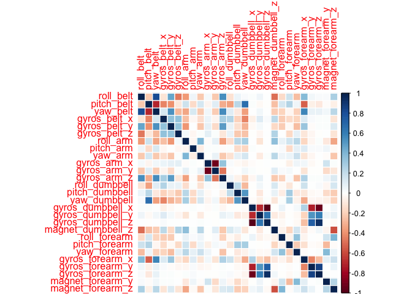

# Practical Machine Learning Project Report
N. Kirnosov  
        
### Introduction  

Using devices such as Jawbone Up, Nike FuelBand, and Fitbit it is now possible 
to collect a large amount of data about personal activity relatively inexpensively. 
These type of devices are part of the quantified self movement – a group of 
enthusiasts who take measurements about themselves regularly to improve their 
health, to find patterns in their behavior, or because they are tech geeks. 
One thing that people regularly do is quantify how much of a particular activity 
they do, but they rarely quantify how well they do it.  

In this project, we will use data from accelerometers on the belt, forearm, 
arm, and dumbell of 6 participants to predict the manner in which they 
did the exercise.  

### Libraries Used


```r
library(caret)
library(randomForest)
library(corrplot)
library(doMC)
```

### Download the Data


```r
trainUrl <-"https://d396qusza40orc.cloudfront.net/predmachlearn/pml-training.csv"
testUrl <- "https://d396qusza40orc.cloudfront.net/predmachlearn/pml-testing.csv"
trainFile <- "./data/pml-training.csv"
testFile  <- "./data/pml-testing.csv"
if (!file.exists("./data")) {
        dir.create("./data")
}
if (!file.exists(trainFile)) {
        download.file(trainUrl, destfile=trainFile, method="curl")
}
if (!file.exists(testFile)) {
        download.file(testUrl, destfile=testFile, method="curl")
}
```

### Read the Data

After the data is downloaded, let us read training data set first.


```r
rawTrainVal <- read.csv("./data/pml-training.csv")
```

These data will be used for model training and validation.
Since there are not too many data, the split is 90% training and 10% validation.


```r
set.seed(1)
inTrain <- createDataPartition(rawTrainVal$classe, p=0.90, list=FALSE)
rawTrain <- rawTrainVal[inTrain, ]
rawVal <- rawTrainVal[-inTrain, ]
```

### Preprocess the Data

In order to make the model training easier, we will try to avoid oversampling 
and eliminate all the data which has low prediction value. 
To start with, we will identify "good" columns and eliminate all the "bad"
columns from the training data set.


```r
Good_Columns <- function(rawData){
        v <- which(lapply(rawData, class) %in% "numeric")
        rawData <- rawData[,v]
        v <- apply(rawData,2,function(x) {sum(is.na(x))}) 
        rawData <- rawData[,which(v == 0)]
        return(names(rawData))
}

goodCols <- Good_Columns(rawTrain)
cleanTrain <- subset(rawTrain,select = goodCols)
```

Next, we will preprocess the training data and eliminate near-zero variables.


```r
preData <-preProcess(cleanTrain,
                     method=c('knnImpute', 'center', 'scale'))

Prep_Data <- function(cleanData,preData){
        prepData <- predict(preData, cleanData)
        v <- nearZeroVar(prepData,saveMetrics=TRUE)
        prepData <- prepData[,v$nzv==FALSE]
        return(prepData)
}

prepTrain <- Prep_Data(cleanTrain,preData)
prepTrain$classe <- rawTrain$classe
```

### Model Training

Now we can build a predictive model for activity recognition using Random Forest algorithm. We will use 10-fold cross validation when applying the algorithm.


```r
registerDoMC()

RFmodel <- train(classe ~., method="rf", data=prepTrain, 
                trControl=trainControl(method='cv'), 
                number=10, allowParallel=TRUE)
```

```
## Loading required package: randomForest
## randomForest 4.6-10
## Type rfNews() to see new features/changes/bug fixes.
```

```r
RFmodel
```

```
## Random Forest 
## 
## 17662 samples
##    27 predictor
##     5 classes: 'A', 'B', 'C', 'D', 'E' 
## 
## No pre-processing
## Resampling: Cross-Validated (10 fold) 
## 
## Summary of sample sizes: 15896, 15895, 15895, 15897, 15896, 15895, ... 
## 
## Resampling results across tuning parameters:
## 
##   mtry  Accuracy   Kappa      Accuracy SD  Kappa SD   
##    2    0.9940553  0.9924799  0.001872343  0.002369021
##   14    0.9940552  0.9924802  0.001692326  0.002141419
##   27    0.9926966  0.9907622  0.002107292  0.002666157
## 
## Accuracy was used to select the optimal model using  the largest value.
## The final value used for the model was mtry = 2.
```

### Model Validation

We can use the remaining 10% of the training data to validate the model.


```r
prepVal <- Prep_Data(subset(rawVal,select = goodCols),preData)
prepVal$classe <- rawVal$classe
ValPred <- predict(RFmodel, prepVal)
CM <- confusionMatrix(ValPred, prepVal$classe)
CM
```

```
## Confusion Matrix and Statistics
## 
##           Reference
## Prediction   A   B   C   D   E
##          A 557   1   0   0   0
##          B   1 378   1   0   0
##          C   0   0 337   1   0
##          D   0   0   4 320   1
##          E   0   0   0   0 359
## 
## Overall Statistics
##                                           
##                Accuracy : 0.9954          
##                  95% CI : (0.9913, 0.9979)
##     No Information Rate : 0.2847          
##     P-Value [Acc > NIR] : < 2.2e-16       
##                                           
##                   Kappa : 0.9942          
##  Mcnemar's Test P-Value : NA              
## 
## Statistics by Class:
## 
##                      Class: A Class: B Class: C Class: D Class: E
## Sensitivity            0.9982   0.9974   0.9854   0.9969   0.9972
## Specificity            0.9993   0.9987   0.9994   0.9969   1.0000
## Pos Pred Value         0.9982   0.9947   0.9970   0.9846   1.0000
## Neg Pred Value         0.9993   0.9994   0.9969   0.9994   0.9994
## Prevalence             0.2847   0.1934   0.1745   0.1638   0.1837
## Detection Rate         0.2842   0.1929   0.1719   0.1633   0.1832
## Detection Prevalence   0.2847   0.1939   0.1724   0.1658   0.1832
## Balanced Accuracy      0.9987   0.9980   0.9924   0.9969   0.9986
```


The estimated accuracy of the model is 99.54%
and the *out of sample error* is 0.46%

### Making a Prediction

Now we can apply the model to make predictions for the testing data.


```r
prepTest <- Prep_Data(subset(read.csv("./data/pml-testing.csv"),
                             select = goodCols),preData)
testingPred <- predict(RFmodel, prepTest)
testingPred
```

```
##  [1] B A B A A E D B A A B C B A E E A B B B
## Levels: A B C D E
```


### Appendix

Correlation Matrix
 
